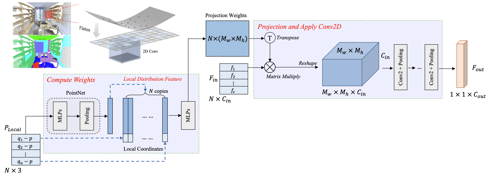

# FPConv

Yiqun Lin, Zizheng Yan, Haibin Huang, Dong Du, Ligang Liu, Shuguang Cui, Xiaoguang Han, "FPConv: Learning Local Flattening for Point Convolution", CVPR 2020 [[paper]](https://arxiv.org/abs/2002.10701)

```
@InProceedings{lin_fpconv_cvpr2020,
    author = {Yiqun Lin, Zizheng Yan, Haibin Huang, Dong Du, Ligang Liu, Shuguang Cui, Xiaoguang Han},
    title = {FPConv: Learning Local Flattening for Point Convolution},
    booktitle = {The IEEE Conference on Computer Vision and Pattern Recognition (CVPR)},
    month = {June},
    year = {2020}
}
```

## Introduction

We introduce FPConv, a novel surface-style convolution operator designed for 3D point cloud analysis. Unlike previous methods, FPConv doesn't require transforming to intermediate representation like 3D grid or graph and directly works on surface geometry of point cloud. To be more specific, for each point, FPConv performs a local flattening by automatically learning a weight map to softly project surrounding points onto a 2D grid. Regular 2D convolution can thus be applied for efficient feature learning. FPConv can be easily integrated into various network architectures for tasks like 3D object classification and 3D scene segmentation, and achieve comparable performance with existing volumetric-type convolutions. More importantly, our experiments also show that FPConv can be a complementary of volumetric convolutions and jointly training them can further boost overall performance into state-of-the-art results.



## Installation

This code has been tested with Python 3.6, PyTorch 1.2.0, CUDA 10.0 and CUDNN 7.4 on Ubuntu 18.04. 

Firstly, install [pointnet2](https://github.com/sshaoshuai/Pointnet2.PyTorch) by running the following commands:

```shell
cd fpconv/pointnet2
python setup.py install
cd ../
```

You may also need to install plyfile and pickle for data preprocessing.

## Usage

Edit the global configuration file `config.json` before training.

```json
{
    "version": "0.1",
    "scannet_raw": "<path_to_scannet_raw>",
    "scannet_pickle": "<path_to_save_scannet_pickle>",
    "scene_list": "<path_to_this_repo>/utils/scannet_datalist",
}
```

### Semantic Segmentation on ScanNet

Download the ScanNetv2 dataset, and generate training data by runing:

```shell
cd utils
python gen_pickle.py
```

__1. Train__

Run the following command to start the training:

```
./train_scannet.sh
```

We trained our model with 2 Titan Xp GPUs with batch size of 12. If you don't have enough GPUs for training, please reduce `batch_size` to 6 for single GPU.

__2. Evaluate__

Run the following command to evaluate model on evaluation dataset (you may need to modify the `epoch` in `./test_scannet.sh`):

```shell
./test_scannet.sh
```

__Note__: Final evaluation (by running `./test_scannet.sh`) is conducted on full point cloud, while evaluation during the training phase is conducted on randomly sampled points in each block of input scene.

## Acknowledgement

- [sshaoshuai/Pointnet2.PyTorch](https://github.com/sshaoshuai/Pointnet2.PyTorch): PyTorch implementation of PointNet++.

## License

This repository is released under MIT License (see LICENSE file for details).

